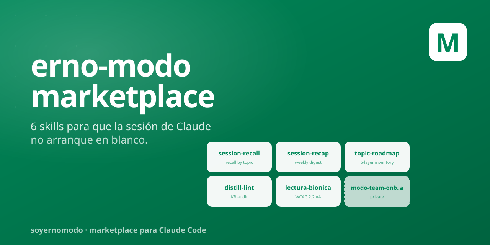

<p align="center">
  
</p>

<h1 align="center">erno-modo-marketplace</h1>

<p align="center">
  <em>Marketplace de skills + agents para Claude Code, hechos por Hernán De Souza.</em>
</p>

<p align="center">
  
  
  
</p>

---

## Qué es

Un **marketplace** Claude Code es un índice de plugins (skills, agents, slash commands, hooks, MCPs) que tu equipo puede instalar con un solo comando. Este marketplace agrupa los plugins que vengo construyendo en `github.com/SoyErnoModo` — todos pensados para que la sesión de Claude Code sea menos memoria-vacía y más cuaderno-bien-indexado.

## Cómo se instala

```bash
# Una sola vez, agregás el marketplace
claude plugin marketplace add SoyErnoModo/erno-modo-marketplace

# Después instalás los plugins que quieras
claude plugin install session-recall
claude plugin install distill-lint
claude plugin install topic-roadmap
claude plugin install session-recap
claude plugin install lectura-bionica
# Privado, sólo si tenés acceso al repo:
claude plugin install modo-team-onboarding
```

## Plugins

| Plugin | Categoría | Qué hace |
|--------|-----------|----------|
| [`session-recall`](https://github.com/SoyErnoModo/session-recall) | productivity | Retomá conversaciones por tema/keyword. Comprime transcripts y devuelve sólo lo cargado. |
| [`session-recap`](https://github.com/SoyErnoModo/session-recap) | productivity | Recap semanal cross-source: PRs + git + branches + sessions, clasificado en Done · WIP · Stalled · Local · Abandoned. |
| [`topic-roadmap`](https://github.com/SoyErnoModo/topic-roadmap) | productivity | Inventario de todo el trabajo cross-source de un tema, en 6 capas de lifecycle, con diagrama Mermaid + JSON. |
| [`distill-lint`](https://github.com/SoyErnoModo/distill-lint) | productivity | Audit read-only del knowledge base destilado. 8 checks: orphans · stale · dead refs · cross-refs · index budget. Inspirado en el LLM Wiki Pattern de Karpathy. |
| [`lectura-bionica`](https://github.com/SoyErnoModo/lectura-bionica) | accessibility | Bionic reading transformer para Markdown. WCAG 2.2 AA. Pensado para TDAH/dislexia y lectura técnica densa. |
| [`modo-team-onboarding`](https://github.com/SoyErnoModo/modo-team-onboarding) 🔒 | productivity | **Privado**. Generador de manual de onboarding MODO Claude Code. Mining + audit config + redact paranoid + template. |

> 🔒 = repo privado. Solo resuelve para usuarios con acceso al source repo en GitHub.

## Hermanos en el ecosistema

Estos plugins fueron diseñados como **piezas independientes** que se complementan en la operación diaria con Claude Code:

```
session-recall       ←→  retomar UNA conversación pasada por tema
session-recap        ←→  ver TODO lo que hice esta semana
topic-roadmap        ←→  mapear TODO lo que existe sobre un tema
distill-lint         ←→  auditar la memoria destilada
lectura-bionica      ←→  hacer legible la salida (TDAH/dislexia)
modo-team-onboarding ←→  generar manual para sumar a alguien al equipo
```

## Filosofía

Inspirado en:
- **LLM Wiki Pattern** de [Andrej Karpathy](https://karpathy.ai/) — tu OS personal con IA es, en el fondo, un cuaderno bien indexado.
- **Zettelkasten** de [Niklas Luhmann](https://en.wikipedia.org/wiki/Zettelkasten) — atomic notes + links como hilos de pensamiento.
- **WCAG 2.2** — la accesibilidad lectora es una decisión técnica, no un nice-to-have.

La conversación termina cuando cerrás el chat. **El conocimiento queda.**

## Licencia

[MIT](LICENSE). Hacé lo que quieras con esto — copialo, modificalo, distribuilo.

## Autor

**Hernán De Souza** — Sr AI Engineer · [@SoyErnoModo](https://github.com/SoyErnoModo) · [erno-modo.bitácora](https://soyernomodo.github.io/erno-modo/)

Si lo mejorás, abrime un PR.
